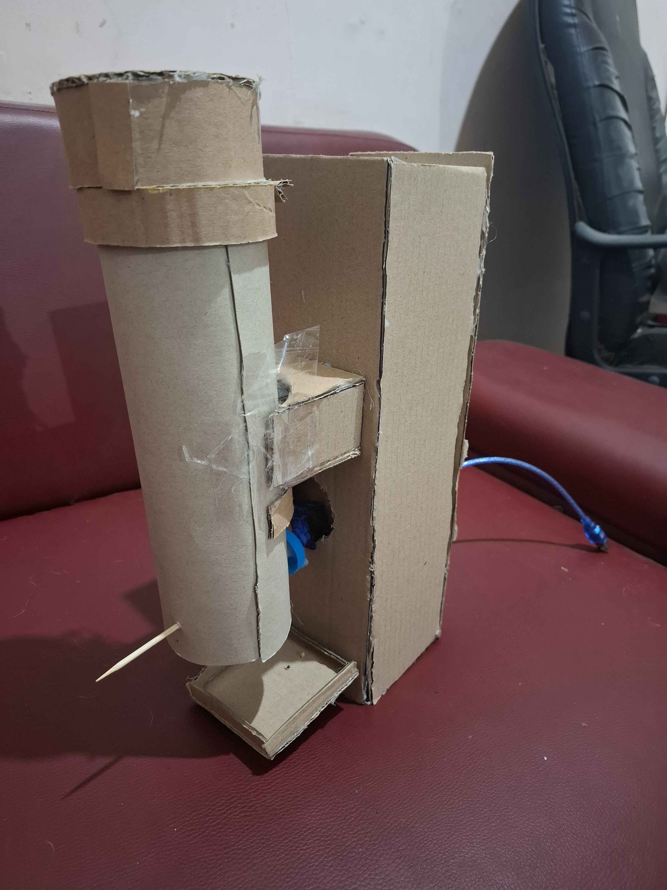
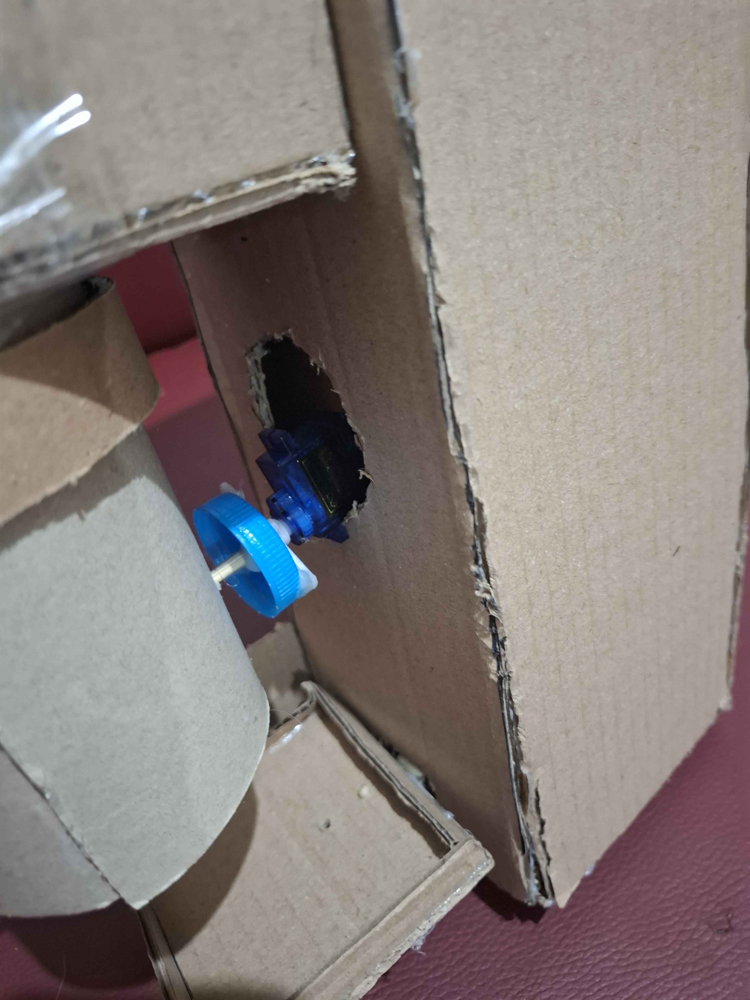
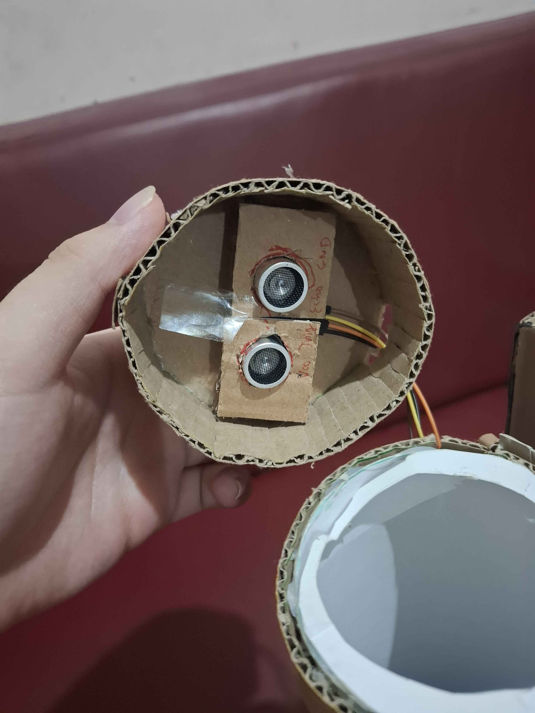
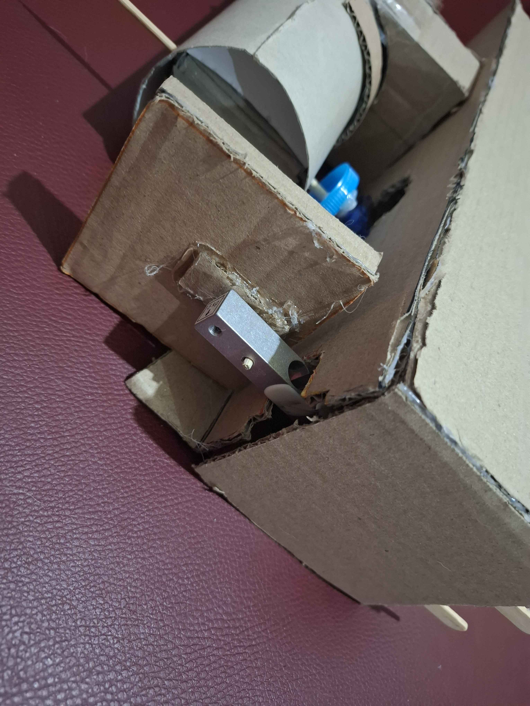

# Project Embedded Automatic Pet Feeder

Projek pet feeder otomatis yang serderhana menggunakan arduino. Terdapat dua sensor yaitu pada container dan mangkuk sehingga sistem dapat mengatur porsi tanpa membuat mangkuk penuh sendiri

# Fitur

- Sensor stok makanan pada container
- Sensor pada mangkuk makanan peliharaan
- Otomatis mengatur porsi makanan

# Cara Kerja

1. Makanan masuk ke dalam kontainer atas
2. Sensor kontainer memastikan isi dari kontainer
3. Sensor di mangkuk memeriksa untuk memastikan kosong atau sudah sedikit
3. servo memutar fan blade membiarkan makanan keluar sebagian
5. jika makanan masih ada atau kontainer makanan sudah habis fan blade tidak akan berputar

# Tech Stack

- Arduino Uno
- Ardino IDE
